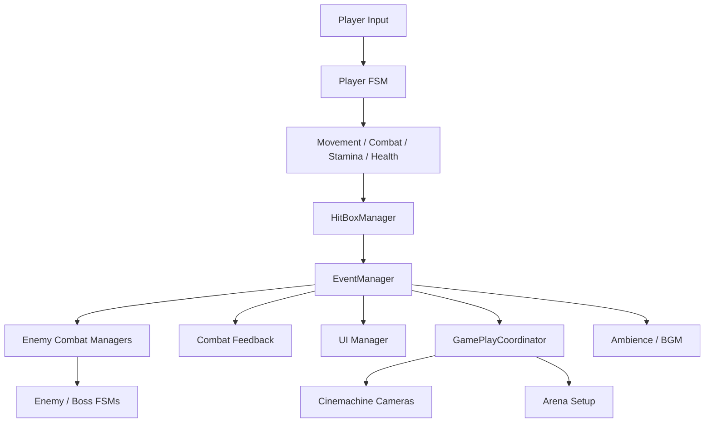
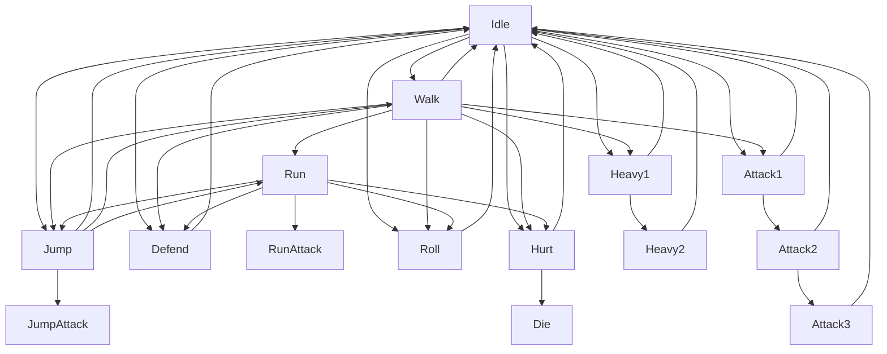
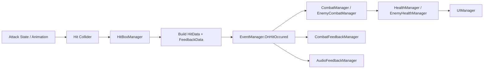

# Architecture

## Overview
Knight of Cinders uses a component-based Unity architecture with actor-specific finite state machines and event-driven cross-system communication.

Key runtime structure:
- Actor roots own state transitions
- Manager components own movement, combat, health, stamina, audio, UI, and feedback
- `EventManager` distributes combat, UI, and progression events
- Coordinators manage encounters, arena flow, and scene context

## High-Level System Architecture

## Architecture Style
- Component-based Unity gameplay code using focused `MonoBehaviour` managers
- FSM-driven actor behavior for player, enemies, and bosses
- Event-driven publish/subscribe for combat, UI, scene, and lifecycle events
- Coordinator-style orchestration for encounters and progression

## FSM Framework
Each actor owns:
- an enum of valid states
- a state dictionary
- a `TransitionState(...)` method
- a current state reference

Player uses `PlayerStateInterface` with:
- `OnEnter()`
- `OnUpdate()`
- `OnExit()`
- `HandleInput()`
- `OnFixedUpdate()`
- `OnGetHit(HitData data)`

Enemies and bosses use `StateTransitionInterface` with:
- `OnEnter()`
- `OnUpdate()`
- `OnExit()`

### Player FSM Flow

<!-- GIF: player-fsm-state-demo -->

## Responsibility Boundaries
### Actor Roots
- `Knight`
- `NewSkeleton`
- `DarkWolf`
- `EvilWizard`
- `EvilWizardPhase2`

Responsibility:
- own state registration
- store current state
- perform transitions

### Player Runtime
- `KnightStates`: player decision layer
- `MovementManager`: locomotion and motion gating
- `CombatManager`: attacks, block rules, hit response
- `StaminaManager`: action costs and regeneration
- `HealthManager`: health, healing, death

### Enemy Runtime
- `EnemyCombatManager`
- `EnemyMovementManager`
- `EnemyHealthManager`

Specialized by enemy family:
- skeleton combat/roles
- wolf combat/phases
- wizard phase controllers

### Global / Cross-Cutting
- `EventManager`: event hub
- `HitBoxManager`: collision-to-hit payload translation
- `UIManager`: health/stamina presentation
- `CombatFeedbackManager`: hit stop and camera shake
- `GamePlayCoordinator`: arena lifecycle and scene context

## Data Flow
Key payloads:
- input commands
- state enums
- `HitData`
- `FeedbackData`
- health values
- stamina values
- damage values
- skeleton roles
- boss phase status
- `ArenaSetUp`
- scene labels
- camera priorities

## Combat Event Pipeline

<!-- GIF: combat-event-pipeline-demo -->

## Design Patterns
Formal patterns clearly present:
- Observer: `EventManager` + subscribers
- Strategy-like behavior objects: interchangeable FSM states

Partial or weaker matches:
- Singleton-like global access through static classes

Not a strict fit:
- full MVC
- factory-heavy architecture

## Employer-Relevant Takeaway
The architecture shows evidence of:
- runtime system decomposition
- behavior-oriented design with FSMs
- event-driven coordination
- gameplay-focused object-oriented programming
