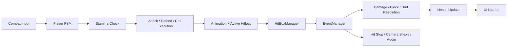
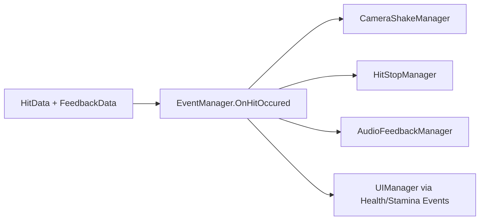

# Combat System

## Overview
The combat system combines state-driven control, stamina gating, directional defense, hit detection, health resolution, and audiovisual feedback.

Primary scripts:
- `CombatManager`
- `StaminaManager`
- `HealthManager`
- `MovementManager`
- `HitBoxManager`
- `CombatFeedbackManager`
- `AudioFeedbackManager`

## Combat Loop

<!-- GIF: player-combat-combo-demo -->

## Player Move Set
Implemented player actions:
- Light combo: `Attack1`, `Attack2`, `Attack3`
- Heavy combo: `HeavyAttack1`, `HeavyAttack2`
- Run attack
- Jump attack
- Shield strike
- Defend / block
- Roll

## Combo System
- Light combo uses timer-based chaining
- Heavy combo uses a separate combo timer
- Late combo steps get stronger feedback values
- Combo state is stored through attack-step flags in `CombatManager`

## Stamina System
Stamina gates both offense and defense.

Primary stamina consumers:
- heavy attack
- sprint
- run attack
- jump attack
- roll
- shield strike
- blocked attacks

Rules:
- regeneration is continuous
- idle and walk states accelerate regeneration
- full depletion delays regeneration restart
- state transitions are denied when stamina is insufficient

## Health and Damage
Player health supports:
- damage intake
- passive regeneration
- healing delay after recent damage
- death detection and event broadcast

Enemy health supports:
- damage intake
- death broadcast
- UI updates through event listeners

## Defensive Rules
- Front-facing block with enough stamina negates damage
- Failed block still costs stamina and can lead to hurt
- Back-facing hits bypass defense
- Roll grants invulnerability during the dodge window
- Attack states are generally interruptible

## Hit Detection
`HitBoxManager` translates collisions into:
- attack initiator
- target hurt box
- runtime damage
- knockback direction
- feedback payload

It then raises the global hit event for downstream listeners.

## Feedback Layer
Combat feedback includes:
- hit stop
- camera shake
- contextual impact audio
- UI bar reactions

### Feedback Runtime Flow

<!-- GIF: hit-feedback-demo -->

## Key Implementation Summary
- State machines decide combat intent
- Managers execute rules and resource costs
- Hit payloads distribute runtime results
- Presentation systems react without owning combat logic

## Employer-Relevant Takeaway
This subsystem demonstrates:
- gameplay rule implementation
- resource-system design
- animation-timed combat sequencing
- event-driven hit resolution
- integration between gameplay and presentation feedback
