# Enemy AI and Bosses

## Overview
Enemy behavior is built from reusable enemy base managers plus actor-specific finite state machines and combat logic. The strongest implementation areas are the skeleton squad-role encounter and the two boss pipelines: Dark Wolf and Evil Wizard.

## Enemy Runtime Structure
- Shared base layer:
  - `EnemyCombatManager`
  - `EnemyMovementManager`
  - `EnemyHealthManager`
- Specialized families:
  - skeletons
  - Dark Wolf
  - Evil Wizard phase 1 / phase 2

## Skeleton Squad Role System
Each skeleton owns a local FSM, but the encounter is coordinated at squad level.

Skeleton states:
- `Defend`
- `Idle`
- `Walk`
- `Attack`
- `Sneak`
- `Hurt`
- `Die`
- `Trap`

Roles:
- `Frontliner`
- `Flanker`
- `Backuper`

### Skeleton Role System Diagram
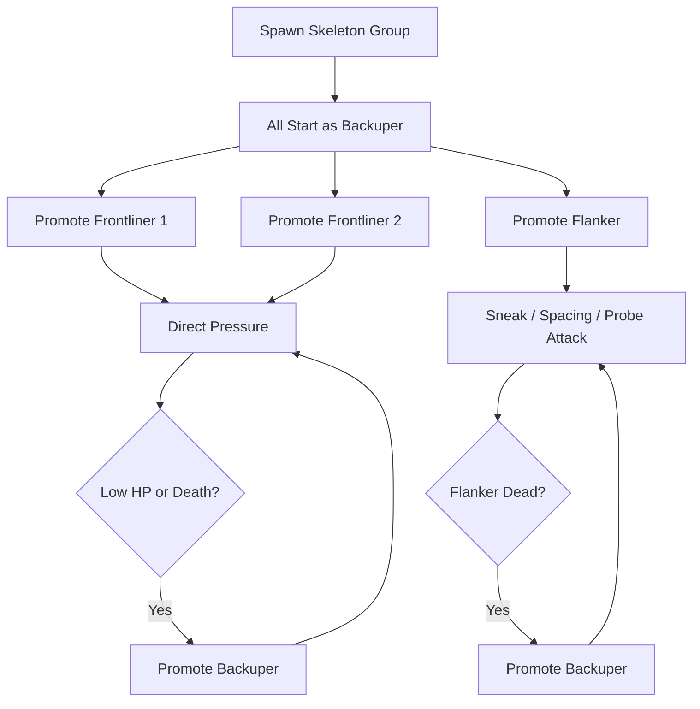

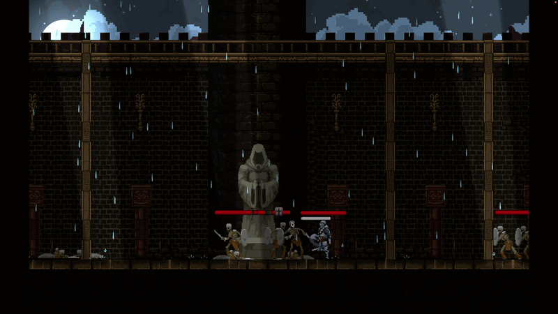

### Runtime Summary
- Frontliners push direct melee pressure
- Flanker manages spacing and timing from a different attack loop
- Backupers hold defensive positions until promoted
- `SkeletonCoordinator` reassigns roles as units weaken or die

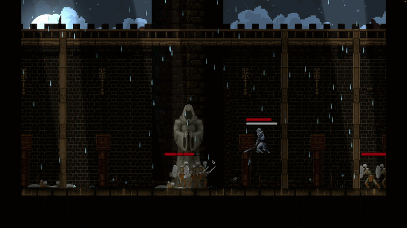

## Trap Skeleton
The tutorial skeleton uses the same actor framework but starts in `Trap` state and is activated by `TrapDetector`.

Runtime flow:
- player enters detector radius
- awakening animation plays
- skeleton transitions into active state
- health bar is enabled

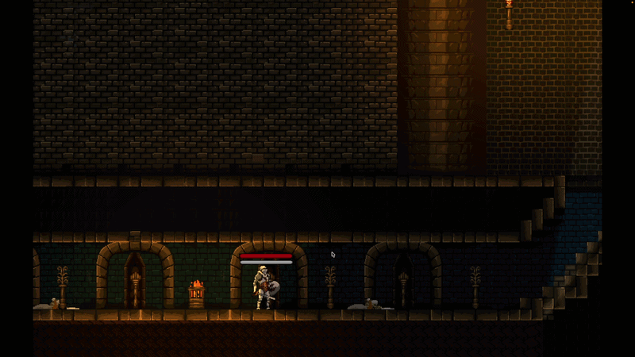

## Dark Wolf
Dark Wolf is an early boss centered on mobility, charge pressure, and a clear phase escalation.

Dark Wolf states:
- `Idle`
- `Walk`
- `Run`
- `Attack`
- `Decide`
- `Berserk`
- `Charge`
- `Vulnerable`
- `Hurt`
- `Die`

### Dark Wolf Boss Flow
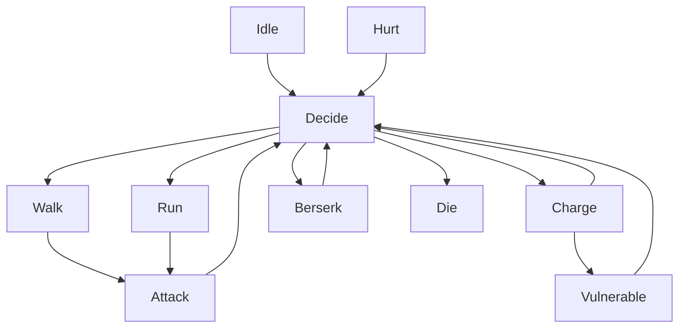

Dark Wolf-specific features:
- health-threshold phase change
- charge windup and collision payoff
- vulnerable punish window after failed charge outcomes

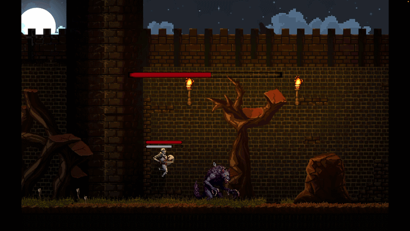

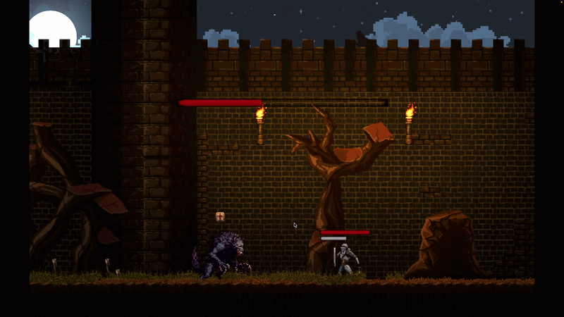

## Evil Wizard
The final boss is split into two separate controllers.

### Phase 1
Focus:
- teaching telegraphs
- spacing pressure
- melee pattern recognition
- teleport finisher

States:
- `IdleMode1`
- `Run`
- `AttackMode1_1`
- `AttackMode1_2`
- `Decide`
- `Vulnerable`
- `Hurt`
- `DeathMode1`

### Phase 2
Focus:
- escalation
- summon pressure
- homing lasers
- laser-wall survival
- vulnerability windows

States:
- `Start`
- `Phase2Decide`
- `Walk`
- `AttackWithEffect`
- `AttackWithoutEffect`
- `HomingLaser`
- `SummonWolf`
- `LaserWall`
- `Phase2Vulnerable`
- `Hurt`
- `Phase2Death`

### Evil Wizard Phase Logic
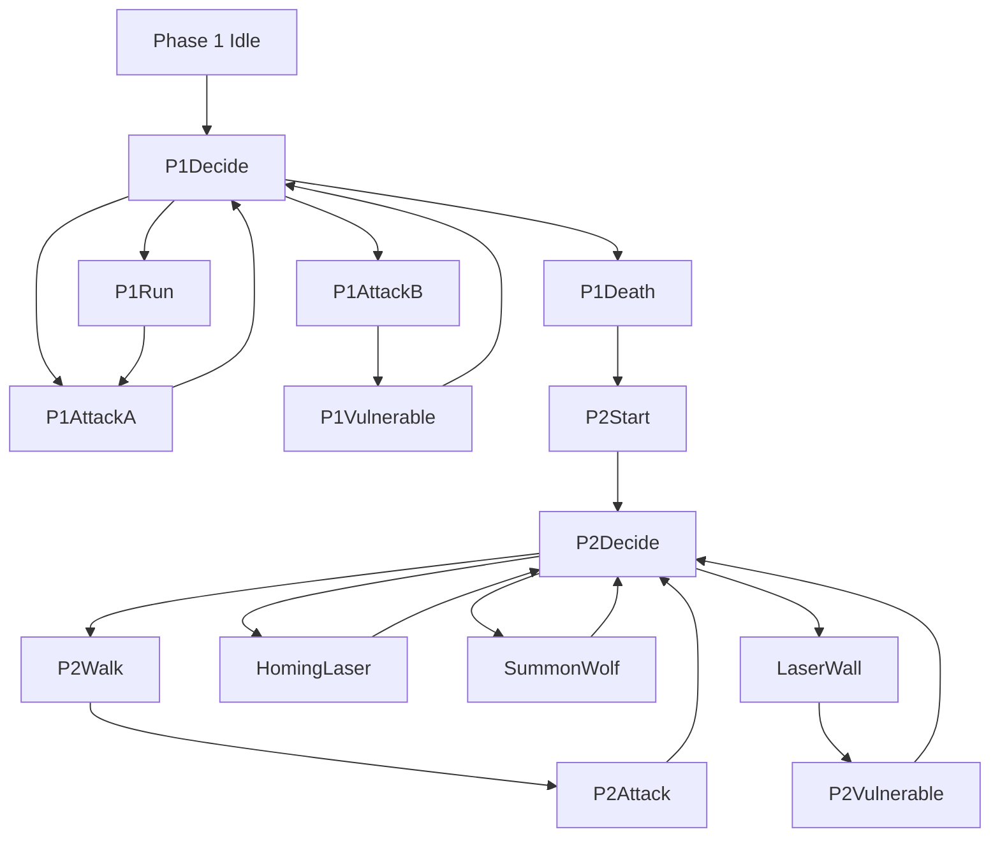

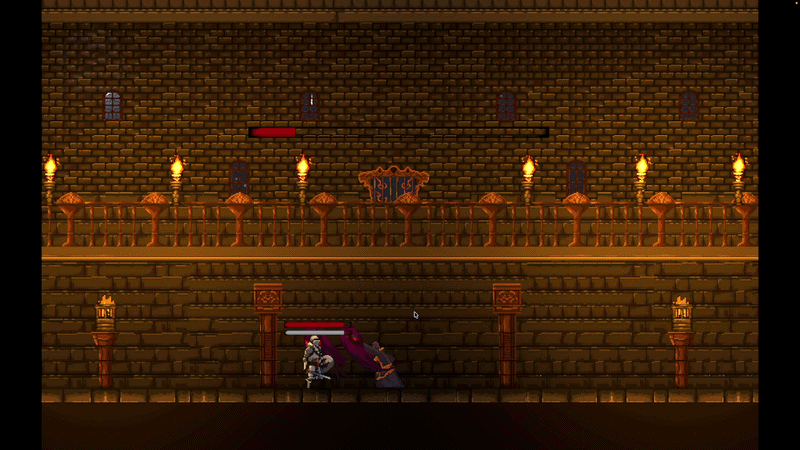

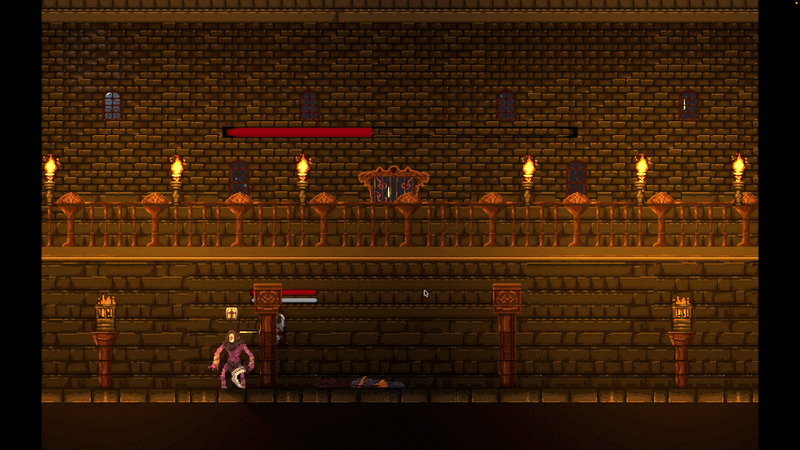

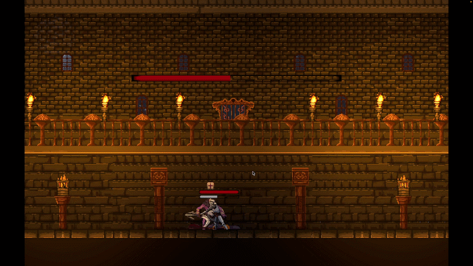

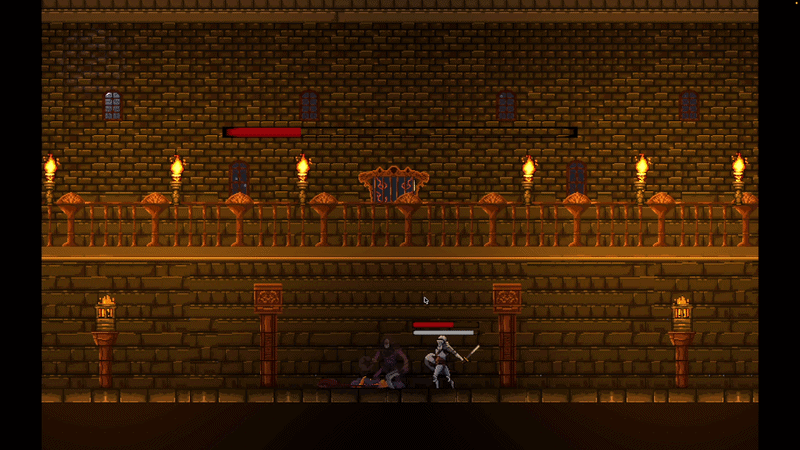

## Employer-Relevant Takeaway
This subsystem demonstrates:
- enemy AI specialization on top of shared bases
- encounter-level orchestration
- boss-phase design and implementation
- state-driven behavior with tactical variation
