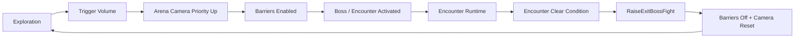
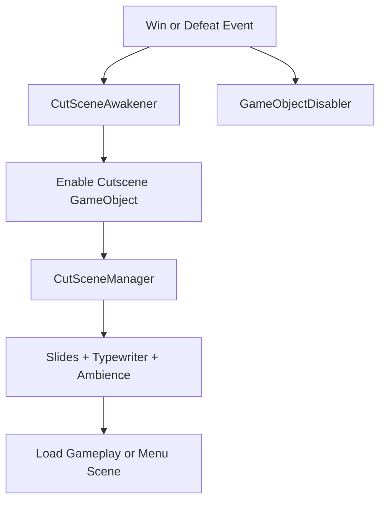

# Scene Flow and Presentation

## Overview
Scene flow and presentation are handled through a combination of scene loading, in-level context switching, Cinemachine camera priorities, ambience managers, UI updates, and cutscene controllers.

## Scene Flow
Primary flow:
- `MainMenu`
- `BeginningCutScene`
- `level1`
- victory / defeat cutscene return to `MainMenu`

Runtime region labels inside `level1`:
- `outside`
- `sewer`
- `dungeon`
- `finalRoom`
- `rainScene`

## Arena and Camera Lifecycle
`GamePlayCoordinator` manages:
- arena triggers
- boss activation
- barrier toggling
- camera priority changes
- fight cleanup
- scene-context labels

### Arena / Encounter Lifecycle

<!-- GIF: arena-lifecycle-demo -->

## Exploration Cameras
Exploration cameras are switched by region trigger membership:
- sewer range
- dungeon range
- final room range

This uses Cinemachine priority changes instead of hard teleports.

## Boss Cameras
Each arena owns its own encounter camera through `ArenaSetUp`.

At runtime:
- encounter trigger raises arena camera priority
- boss fight starts
- camera shake rebinds to the active arena camera
- cleanup lowers the arena camera priority

## Ambience and Music
`AmbienceManager` reacts to scene-label changes and swaps:
- looped ambience
- one-shot environmental sounds

`BackGroundMusicManager` reacts to:
- enter boss fight
- exit boss fight
- victory
- defeat

## UI
`UIManager` handles:
- player health bar
- enemy health bars
- stamina bar
- delayed bar animations

This presentation reacts to health and stamina events rather than polling combat directly.

## Cutscene Flow
`CutSceneManager` handles:
- slide sequencing
- typewriter text
- continue prompts
- opening / victory / defeat routing

`CutSceneAwakener` activates winning or defeat cutscenes from gameplay events.

`GameObjectDisabler` disables tagged gameplay objects during cutscene handoff.

### Cutscene / Gameplay Handoff

<!-- GIF: cutscene-handoff-demo -->

## Employer-Relevant Takeaway
This subsystem demonstrates:
- scene-flow orchestration
- Cinemachine-based camera direction
- presentation systems tied cleanly to gameplay events
- UI and ambience integration without burying everything in combat code
